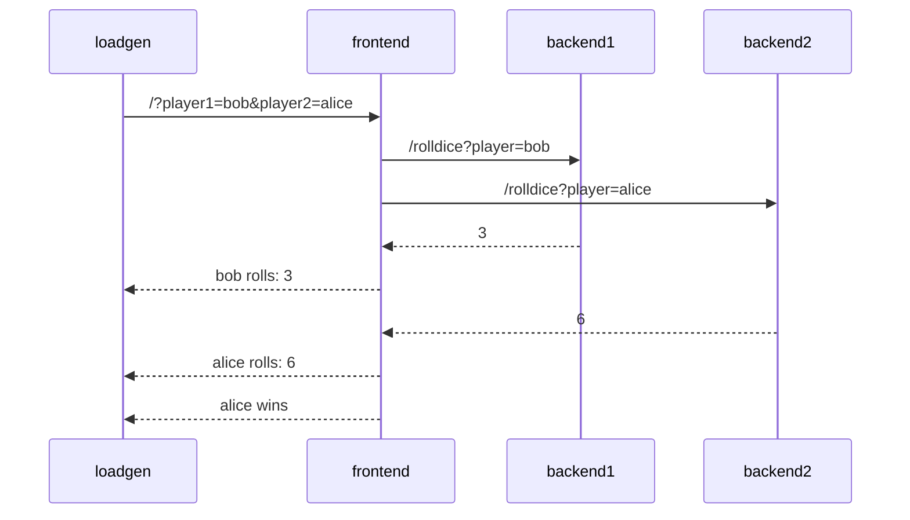
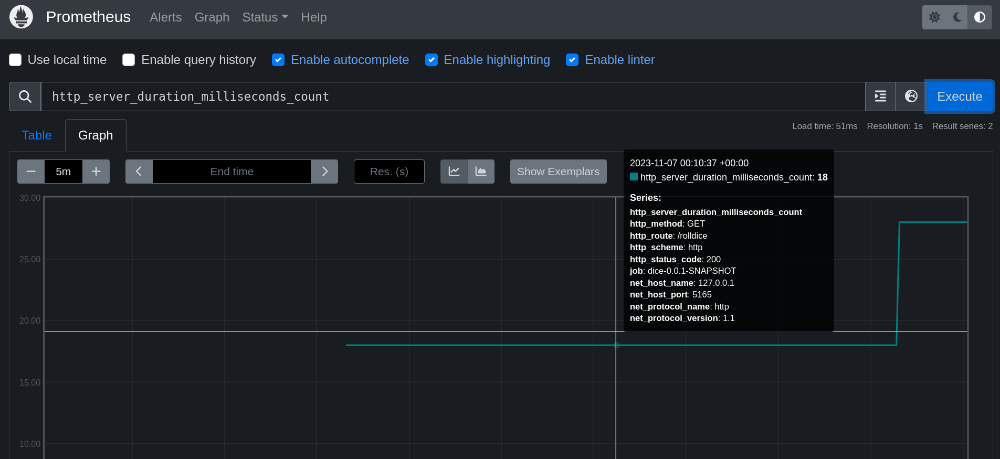

# OpenTelemetry metrics instrumentation

This tutorial step focuses on instrumenting the services of the [sample application](./app).

## Application Description

The sample application is a simple _"dice game"_, where two players roll a
dice, and the player with the highest number wins.

There are 3 microservices within this application:

- Service `frontend` in Node.JS, that has an API endpoint `/` which takes two
  player names as query parameters (player1 and player2). The service calls 2
  down stream services (backend1, backend2), which each returning a random number
  between 1-6. The winner is computed and returned.
- Service `backend1` in python, that has an API endpoint `/rolldice` which takes
  a player name as query parameter. The service returns a random number between
  1 and 6.
- Service `backend2` in Java, that also has an API endpoint `/rolldice` which
  takes a player name as query parameter. The service returns a random number
  between 1 and 6.

Additionally there is a `loadgen` service, which utilizes `curl` to periodically
call the frontend service.

Let's assume player `alice` and `bob` use our service, here's a potential
sequence diagram:



## Manual or Automatic Instrumentation?

To make your application emit traces, metrics & logs you can either instrument
your application _manually_ or _automatically_:

- Manual instrumentation means that you modify your code yourself: you initialize and
  configure the SDK, you load instrumentation libraries, you create your own spans,
  metrics using the API.
  Developers can use this approach to tune the observability of their application to
  their needs.
- Automatic instrumentation means that you don't have to touch your code to get your
  application emit telemetry data.
  Automatic instrumentation is great to get you started with OpenTelemetry, and it is
  also valuable for Application Operators, who have no access or insights about the
  source code.

In the following we will introduce you to both approaches.

## Manual Instrumentation

As a developer you can add OpenTelemetry to your code by using the
language-specific APIs and SDKs.

In this tutorial we will only instrument the [frontend](./app/frontend) service manually, we will use
automatic instrumentation for the other services in the next step.

For development, you can run the app locally by installing all dependencies
and running it with `nodemon` from the [./app/frontend](./app/frontend/) directory:

```bash
cd app/frontend
npm install
npx nodemon index.js
```

If you don't have `Node.JS` installed locally, you can use a container for development:

```bash
cd app/frontend
docker run -p 4000:4000 --rm -it --workdir=/app -v ${PWD}:/app:z node:18-alpine /bin/sh
npm install
npx nodemon index.js
```

Open the [index.js](./app/frontend/index.js) file with your preferred editor.
Use the instructions provided by the
[official OpenTelemetry documentation](https://opentelemetry.io/docs/instrumentation/js/getting-started/nodejs/)
to add tracing & metrics. A few differences in your implementation:

- Instead of creating a dedicated `instrument.js` you can add the initialization of the SDK at the top of `index.js` directly.

Give it a try yourself, if you are unsure how to accomplish this, you can peek
into the [instrument.js](./app/frontend/instrument.js) file.

To see if spans are emitted to the collector, call the frontend service via your
browser or curl:

```bash
curl localhost:4000/
```

The **Internal Server Error** response is OK for now, because you don't have the backends
running.

If all works, the frontend application should emit metrics and print them to the standard output:
```
{
  descriptor: {
    name: 'request_total',
    type: 'UP_DOWN_COUNTER',
    description: 'A counter of request',
    unit: '',
    valueType: 0
  },
  dataPointType: 3,
  dataPoints: [
    { attributes: {}, startTime: [Array], endTime: [Array], value: 1 }
  ]
}
```

Now replace the `ConsoleSpanExporter` with an `OTLPTraceExporter` as outlined in the [Exporters](https://opentelemetry.io/docs/instrumentation/js/exporters/) documentation (make use of OTLP HTTP exporter)

The metrics can be reported to the Prometheus server running locally:
```bash
docker run --rm -it -p 9090:9090 --name=p8s -v ./app/prometheus-docker.yaml:/tmp/prometheus-docker.yaml:z prom/prometheus:v2.47.2 --config.file=/tmp/prometheus-docker.yaml --enable-feature=otlp-write-receiver
```

<details>

<summary>(Optionally) Run a OpenTelemetry Collector instead of Prometheus</summary>

Alternatively, you can run the OpenTelemetry collector locally with debug exporter (use OTLP gRPC exporter, make use of `opentelemetry/exporter-metrics-otlp-grpc` & `opentelemetry/exporter-trace-otlp-grpc`):
```bash
docker run --rm -it -p 4317:4317 --name=otel-collector ghcr.io/open-telemetry/opentelemetry-collector-releases/opentelemetry-collector:0.88.0 --config https://raw.githubusercontent.com/pavolloffay/kubecon-na-2023-opentelemetry-kubernetes-metrics-tutorial/main/app/collector-docker.yaml
```

</details>

Finally, look into the `index.js` file once again, there are a few additional `TODOs` for you!

## Simplified instrumentalisation

There are other applications that can be fundamentally instrumentalised.

1. middlewares for different frameworks in different programming languages. ([js-contrib](https://github.com/open-telemetry/opentelemetry-js-contrib))
1. auto-instrumentation libaries, which do not require any code changes. ([nodejs-auto-instrumentation](https://github.com/open-telemetry/opentelemetry-js-contrib/tree/main/metapackages/auto-instrumentations-node#supported-instrumentations))

SDKs for manual instrumentation, tools such as middlewares for instrumenting specific frameworks or auto-instrumentation are available in several languages like [go](https://github.com/open-telemetry/opentelemetry-go-instrumentation), [java](https://github.com/open-telemetry/opentelemetry-java-instrumentation), [python](https://github.com/open-telemetry/opentelemetry-python-contrib), [dotnet](https://github.com/open-telemetry/opentelemetry-dotnet-instrumentation) and more!

### Run Java Auto-Instrumentation

In order to use the Java auto-instrumentation we need to [download](https://github.com/open-telemetry/opentelemetry-java-instrumentation/releases) (`curl -SL https://github.com/open-telemetry/opentelemetry-java-instrumentation/releases/download/v1.31.0/opentelemetry-javaagent.jar`) and [configure](https://opentelemetry.io/docs/instrumentation/java/automatic/agent-config/#sdk-autoconfiguration) the java agent.

```bash
# build demo backend2
cd app/backend2/
./gradlew build
# run and export to console
JAVA_TOOL_OPTIONS="-javaagent:opentelemetry-javaagent.jar" OTEL_METRICS_EXPORTER=logging-otlp OTEL_LOGS_EXPORTER=none OTEL_TRACES_EXPORTER=none java -jar ./build/libs/dice-0.0.1-SNAPSHOT.jar
# run and export to prometheus
JAVA_TOOL_OPTIONS="-javaagent:opentelemetry-javaagent.jar" OTEL_EXPORTER_OTLP_METRICS_ENDPOINT=http://p8s:9090/api/v1/otlp/v1/metrics OTEL_EXPORTER_OTLP_METRICS_PROTOCOL=http/protobuf OTLP_METRICS_EXPORTER=otlp OTEL_LOGS_EXPORTER=none OTEL_TRACES_EXPORTER=none java -jar ./build/libs/dice-0.0.1-SNAPSHOT.jar
```

If you don't have `Java` installed locally, you can use a container for development:

```bash
docker run -p 5165:5165 --link p8s:p8s --rm -it --workdir=/app -v ${PWD}:/app:z gradle:7.2.0-jdk17 /bin/bash
# run and export to prometheus
JAVA_TOOL_OPTIONS="-javaagent:opentelemetry-javaagent.jar" OTEL_EXPORTER_OTLP_METRICS_ENDPOINT=http://p8s:9090/api/v1/otlp/v1/metrics OTEL_EXPORTER_OTLP_METRICS_PROTOCOL=http/protobuf OTLP_METRICS_EXPORTER=otlp OTEL_LOGS_EXPORTER=none OTEL_TRACES_EXPORTER=none java -jar ./build/libs/dice-0.0.1-SNAPSHOT.jar
```

Using `curl http://127.0.0.1:5165/rolldice` we can generate some metrics and report them to the [Prometheus-Dashboard](http://127.0.0.1:9090/graph?g0.expr=http_server_duration_milliseconds_count&g0.tab=0&g0.stacked=0&g0.show_exemplars=0&g0.range_input=5m).



<details>

<summary>(Optionally) Try NodeJS Auto-Instrumentation</summary>

In this case, the `@opentelemetry/auto-instrumentations-node/register` module must be loaded before the `app.js` script is executed. This module includes auto instrumentation for all supported instrumentations and all available data exporters. ([Package details](https://www.npmjs.com/package/@opentelemetry/auto-instrumentations-node))

```bash
cd app/frontend
NODE_OPTIONS="--require @opentelemetry/auto-instrumentations-node/register" OTEL_EXPORTER_OTLP_METRICS_ENDPOINT="http://localhost:9090/api/v1/otlp/v1/metrics" OTEL_SERVICE_NAME="auto-instr-demo" node index.js
```

Output:
```
{
  descriptor: {
    name: 'http.server.duration',
    type: 'HISTOGRAM',
    description: 'Measures the duration of inbound HTTP requests.',
    unit: 'ms',
    valueType: 1
  },
  dataPointType: 0,
  dataPoints: [
    {
      attributes: [Object],
      startTime: [Array],
      endTime: [Array],
      value: [Object]
    }
  ]
}
{
  descriptor: {
    name: 'http.client.duration',
    type: 'HISTOGRAM',
    description: 'Measures the duration of outbound HTTP requests.',
    unit: 'ms',
    valueType: 1
  },
  dataPointType: 0,
  dataPoints: [
    {
      attributes: [Object],
      startTime: [Array],
      endTime: [Array],
      value: [Object]
    }
  ]
}
```

</details>

---
[Next steps](./04-deploy-and-manage-collector.md)
