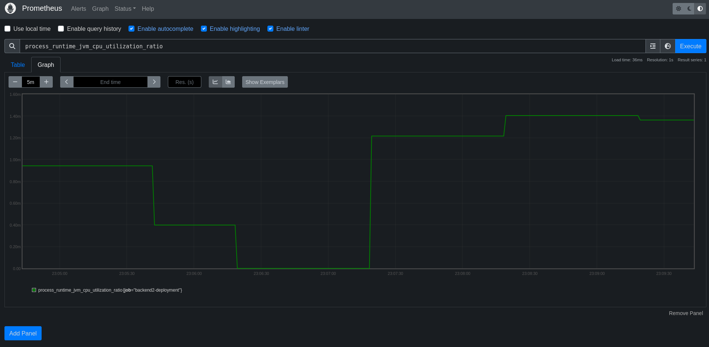

# Using Auto-Instrumentation and Deploying collector on Kubernetes

This tutorial step covers the basic usage of the [OpenTelemetry Collector](https://github.com/open-telemetry/opentelemetry-collector) and [OpenTelemetry Operator](https://github.com/open-telemetry/opentelemetry-operator).

### OpenTelemetry Operator

By today the OpenTelemetry Operator offers two `CustomResouceDefinitions`.

1. The `v1alpha1.Instrumentation` can be used to configure applications that are configured with the OpenTelemetry-SDK and injection of auto-instrumentation libraries. Currently Apache HTTPD, DotNet, Go, Java, Nginx, NodeJS and Python are supported. [Readme](https://github.com/open-telemetry/opentelemetry-operator/blob/v0.88.0/README.md#opentelemetry-auto-instrumentation-injection)

2. The `v1alpha1.OpenTelemetryCollector` simplifies the operation of the OpenTelemetry Collector on Kubernetes. There are different deployment modes available, breaking config changes are migrated automatically, provides integration with Prometheus (including operating on Prometheus Operator CRs) and simplifies sidecar injection.

### Auto-instrumentation

Make sure the demo application is deployed and running:

```bash
kubectl apply -f https://raw.githubusercontent.com/pavolloffay/kubecon-na-2023-opentelemetry-kubernetes-metrics-tutorial/main/app/k8s.yaml
```

To create an Instrumentation resource for our sample application run the following command:

```bash
kubectl apply -f https://raw.githubusercontent.com/pavolloffay/kubecon-na-2023-opentelemetry-kubernetes-metrics-tutorial/main/backend/04-metrics-auto-instrumentation.yaml
```

https://github.com/pavolloffay/kubecon-na-2023-opentelemetry-kubernetes-metrics-tutorial/blob/96f64f61e4a18c7796fe9120a3c51349e93de878/backend/04-metrics-auto-instrumentation.yaml#L1-L15

Until now we only have created the Instrumentation resource, in a next step you need to opt-in your services for auto-instrumentation. This is done by updating your service's `spec.template.metadata.annotations`.

### Configure Java backend2 instrumentation

Before applying the annotation let's take a look at the pod specification:

```bash
kubectl get pods -n tutorial-application -l app=backend2 -o yaml
```

All you need to do now, is to inject the configuration:
```bash
kubectl patch deployment backend2-deployment -n tutorial-application -p '{"spec": {"template":{"metadata":{"annotations":{"instrumentation.opentelemetry.io/inject-java":"true"}}}} }'
```

In case of using the manual instrumentation, the follwoing annotation would be set to only configure the SDK:

```yaml
instrumentation.opentelemetry.io/inject-sdk: "true"
```

Now verify that it worked:

```bash
kubectl get pods -n tutorial-application -l app=backend2 -o yaml
```

and access [metrics](http://127.0.0.1:9090/graph?g0.expr=process_runtime_jvm_cpu_utilization_ratio&g0.tab=0&g0.stacked=0&g0.show_exemplars=0&g0.range_input=5m)



or [traces](http://127.0.0.1:16686/search).


Example how to configure [Node.JS](https://github.com/pavolloffay/kubecon-eu-2023-opentelemetry-kubernetes-tutorial/blob/main/03-app-instrumentation.md#configure-nodejs---frontend-service).

## Collector Overview


The OpenTelemetry Collector can be divided into a few major components.

- **Receivers**: Collect data from a specific source, like an application or infrastructure, and convert it into [pData (pipeline data)](https://pkg.go.dev/go.opentelemetry.io/collector/consumer/pdata#section-documentation). This component can be active (e.g. Prometheus) or passive (OTLP).
- **Processors**: Manipulates the data collected by receivers in some way. For example, a processor might filter out irrelevant data, or add metadata to help with analysis. Examples include the batch or metric renaming processor.
- **Exporters**: Send data to an external system for storage or analysis. Examples of exporters are Prometheus, Loki or the OTLP exporter.
- **Extensions**: Add additional functionality to OpenTelemetry collector that is not strictly related to the telemetry data, like configuring a bearer token or offering a Jaeger remote sampling endpoint.
- **Connectors**: Is both an exporter and receiver. It consumes data as an exporter in one pipeline and emits data as a receiver in another pipeline.

The components are composed into **pipelines**, that are separated by signal type (metrics, traces, logs). Each datapoint is then goes through the chain consisting receiver(s) -> processor(s) -> exporter(s). For more details, check the [offical documentation](https://opentelemetry.io/docs/collector/).

### Configuration

The configuration of the Open Telemetry Collector is described in YAML. The following shows an `OTLP/gRPC` receiver listening on `localhost:4317`. A batch processor with default parameters and a logging exporter with a normal log level. It also describes multiple pipelines for different telemetry data, which all route their collected telemetry data to the logging exporter.

The easiest way to learn more about the configuration options of individual components is to visit the readme in the component folder directly. Example [debugexporter](https://github.com/open-telemetry/opentelemetry-collector/blob/v0.88.0/exporter/debugexporter#getting-started).

```yaml
receivers:
  otlp:
    protocols:
      grpc:
        endpoint: 127.0.0.1:4317
processors:
  batch:

exporters:
  debug:
    verbosity: normal

service:
  pipelines:
    metrics:
      receivers: [otlp]
      processors: [batch]
      exporters: [debug]
```

### OpenTelemetryCollector CR

In previous section, we have seen how to instrument your application both manually and automatically, with the help of the `Instrumentation` custom resource. In this section, we will take it one step further and introduce the actual OpenTelemetry Collector to the equation. Instead of sending the telemetry signals directly into our backend, we will send them to a collector that will be created by the operator, based on our CR definition.

First, lets inspect our `OpenTelemetryCollector` CR we have prepared. We will use the the basic configuration we have introduced previously and make the collector export the application metrics to the standard output, with the help of the [debug](https://github.com/open-telemetry/opentelemetry-collector/blob/v0.88.0/exporter/debugexporter#getting-starte) exporter.

https://github.com/pavolloffay/kubecon-na-2023-opentelemetry-kubernetes-metrics-tutorial/blob/206dc59a8dc21fd5d7246b2c7a4b402c92bc7dbf/backend/04-collector-basic.yaml#L6-L14

Apart from the `config` and other commonly found parts of the `spec` you might see in other Kubernetes resources (such as `image`, `replicas`, `resources` or even `autoscaler`), there are couple of parameters that are specific to the OpenTelemetry operator logic:

- `mode` - Defines the deployment mode of the collector. This needs to one of the following values: `deployment`, `daemonset`, `statefulset`, `sidecar`. The default value is `deployment`.
- `upgradeStrategy` - Decides whether the collector instance should be automatically updated by the operator or not. Possible values are `automatic`, `none`. The default value is `automatic`.
- `targetAllocator` - Determines whether an instance of a [target allocator](https://github.com/open-telemetry/opentelemetry-operator/tree/main/cmd/otel-allocator#target-allocator) should be created. Target allocator is a special, optional component that decouples service discovery and metric collection functions of Prometheus in a way that allows for their independent scaling. It will be introduced in more details in section 5. By default, target allocator is not created.
- `serviceAccount` - Service account to be used by the collector. Important especially for collector configured with receivers that are responsible for collecting telemetry from the Kubernetes cluster, which requires the collector to have appropriate permissions.

Finally, let's create our `OpenTelemetryCollector` CR:

```bash
kubectl apply -f https://raw.githubusercontent.com/pavolloffay/kubecon-na-2023-opentelemetry-kubernetes-metrics-tutorial/main/backend/04-collector-basic.yaml
```

Let's verify our CR was created correctly:

```bash
kubectl get -n observability-backend opentelemetrycollectors.opentelemetry.io
```

Expected output:
```bash
NAME         MODE         VERSION   READY   AGE     IMAGE                                                                                            MANAGEMENT
otel-basic   deployment   0.88.0    1/1     5m55s   ghcr.io/open-telemetry/opentelemetry-collector-releases/opentelemetry-collector-contrib:0.88.0   managed
```

And see that the collector is actually running:

```bash
kubectl get -n observability-backend -l app.kubernetes.io/managed-by=opentelemetry-operator pod
```

Expected output:
```bash
NAME                                    READY   STATUS    RESTARTS   AGE
otel-basic-collector-5bf5fbd9d9-prqtb   1/1     Running   0          6m39s
```

At last, let's check the logs of the collector to see that it is actually collecting the metrics from our application:

```bash
kubectl logs -n observability-backend deployments/otel-basic-collector
```

Wait a minute, I don't see any metrics being printed out. What's missing? That's right, we still haven't updated our `Instrumentation` CR to point it to our new collector instance. Let's do that now by applying updated `Instrumentation` CR with the following command:

```bash
kubectl apply -f https://raw.githubusercontent.com/pavolloffay/kubecon-na-2023-opentelemetry-kubernetes-metrics-tutorial/main/backend/04-metrics-auto-instrumentation-collector.yaml
```

Check the logs again and observe the metrics being printed. That looks better!

Now we understand and we've seen how the `Instrumentation` and `OpenTelemetryCollector` CRs work independently and together. In next sections, we'll dive deeper into the configuration of the collector and see how we can use the collector and operator CRs to collect metrics from our Kubernetes cluster.

---
[Next steps](./05-collecting-prometheus-metrics.md)
