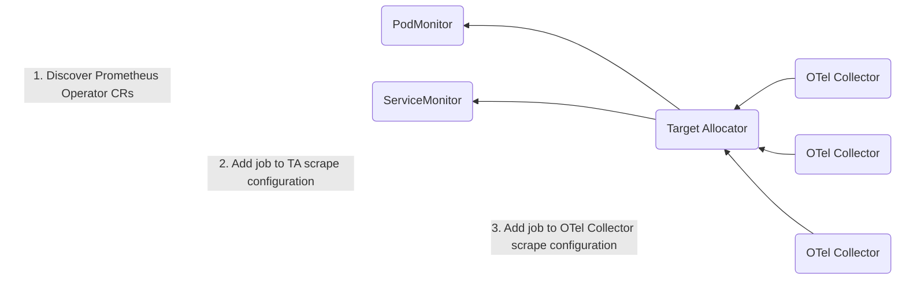

# Collecting Prometheus Metrics

This section of the tutorial will specifically focus on:

1. Migrating from Prometheus to OpenTelemetry
2. Scaling metrics collection with the Target Allocator
3. Interoperability between Prometheus and OTLP standards
4. Considerations and current limitations

## Prerequisites

**Tutorial Application**:
- In the previous section, auto instrumentation collected OTLP metrics from frontend, backend1, and backend2 services.
- Manual instrumentation of the backend 2 application generated Prometheus metrics in the previous setup.

**Prometheus Setup**:
- Prometheus has been installed in the environment.
- Remote write functionality is enabled to export metrics.

## 1. Migrating from Prometheus to OpenTelemetry

Prometheus has been widely embraced by the community. The long-term objective involves moving towards OpenTelemetry, which entails adopting new instrumentation methods. This journey involves updating frameworks and rewriting code. The transition to OpenTelemetry can occur progressively and in incremental steps. 

**Step 1: Prometheus Target Discovery Configrations**

1. **Native Prometheus Target Discovery**

    ```yaml
    scrape_configs:

      # App monitoring - Scraping job using 'static_config'
      - job_name: 'backend2-scrape-job'
        scrape_interval: 1m
        static_configs:
          - targets: ["my-target:8888"]

      # Prometheus self monitoring
      - job_name: 'prometheus-self'
        scrape_interval: 30s
        static_configs:
          - targets: ["localhost:9090"]
        
    # Remote write exporter
    remote_write:
      - url: http://prom-service:9090/api/v1/write
      ```
2. **Target Discovery with Prometheus CR's using Service and Pod Monitors**

    The Prometheus operator lets us define [Prometheus CR's](https://github.com/prometheus-operator/prometheus-operator#customresourcedefinitions) and makes Prometheus scrape configurations much simpler.

    In order to apply a pod or service monitor, the CRDs need to be installed:

    ```shell
    kubectl apply -f https://raw.githubusercontent.com/prometheus-operator/prometheus-operator/main/example/prometheus-operator-crd/monitoring.coreos.com_servicemonitors.yaml

    kubectl apply -f https://raw.githubusercontent.com/prometheus-operator/prometheus-operator/main/example/prometheus-operator-crd/monitoring.coreos.com_podmonitors.yaml
    ```

    You can verify both CRDs are present with the command `kubectl get customresourcedefinitions`. After that, ensure that the following lines are added to your list of CRDs.

    ```shell
    podmonitors.monitoring.coreos.com         
    servicemonitors.monitoring.coreos.com      
    ```

**Step 2: OpenTelemetry Collector Setup**

  The second step involves adapting the above Prometheus scenarios to OpenTelemetry collector. 
   
  Receivers:

  - **Prometheus Receiver:** The Prometheus receiver is a minimal drop-in replacement for the collection of those metrics. It supports the full set of Prometheus scrape_config options.

  Exporters:
  - **Prometheus Exporter:** Pull-based 
  - **Prometheus Remote Write**: Push-based
  - **Logging Exporter** 

Prometheus Service Discovery- Collector CR Configuration:

```yaml
kind: OpenTelemetryCollector
metadata:
  name: collector-demo
spec:
  mode: statefulset
  replicas: 3
  config: |
    receivers:
      prometheus:
        config:
          scrape_configs:
          - job_name: 'otel-collector'
            scrape_interval: 10s
            static_configs:
            - targets: [ '0.0.0.0:8888' ]
            metric_relabel_configs:
            - action: labeldrop
              regex: (id|name)
              replacement: $$1
            - action: labelmap
              regex: label_(.+)
              replacement: $$1
          - job_name: 'backend1-scrape-job'
            scrape_interval: 1m
            static_configs:
            - targets: ["my-target:8888"]
      exporters:
        logging:
          loglevel: debug
        prometheus:
          endpoint: 0.0.0.0:8888
          metric_expiration: 10m
        prometheusremotewrite:
          endpoint: http://prom-service:9090/api/v1/write
    service:
      pipelines:
        metrics:
          exporters:
          - prometheusremotewrite
          - logging
          processors: []
          receivers:
          - prometheus
```

TODO : Callout the $$ 

## 2. Scaling metrics pipeline with the target allocator

The Prometheus receiver is Stateful, which means there are important details to consider when using it:

The collector cannot auto-scale the scraping process when multiple replicas of the collector are run.
When running multiple replicas of the collector with the same config, it will scrape the targets multiple times.
Users need to configure each replica with a different scraping configuration if they want to manually shard the scraping process.

To make configuring the Prometheus receiver easier, the OpenTelemetry Operator includes an optional component called the Target Allocator. This component can be used to tell a collector which Prometheus endpoints it should scrape.

The TA serves two functions:

1. Even distribution of Prometheus targets among a pool of Collectors
2. Discovery of Prometheus Custom Resources

Native Prometheus - Collector CR Configuration:

```yaml
kind: OpenTelemetryCollector
metadata:
  name: collector-with-ta
spec:
  mode: statefulset
  replicas: 3
  targetAllocator:
    enabled: true
    replicas: 2
    image: ghcr.io/open-telemetry/opentelemetry-operator/target-allocator:0.74.0
    allocationStrategy: consistent-hashing
    prometheusCR:
      enabled: false
  config: |
    receivers:
      prometheus:
        config:
          target_allocator:
            endpoint: http://otel-prom-cr-targetallocator:80
            interval: 30s
            collector_id: ${POD_NAME}
            http_sd_config:
              refresh_interval: 60s
          scrape_configs:
          - job_name: 'otel-collector'
            scrape_interval: 10s
            static_configs:
            - targets: [ '0.0.0.0:8888' ]
            metric_relabel_configs:
            - action: labeldrop
              regex: (id|name)
              replacement: $$1
            - action: labelmap
              regex: label_(.+)
              replacement: $$1
          - job_name: 'backend1-scrape-job'
            scrape_interval: 1m
            static_configs:
            - targets: ["my-target:8888"]
      exporters:
        logging:
          loglevel: debug
        prometheus:
          endpoint: 0.0.0.0:8888
          metric_expiration: 10m
        prometheusremotewrite:
          endpoint: http://prom-service:9090/api/v1/write
    service:
      pipelines:
        metrics:
          exporters:
          - prometheusremotewrite
          - logging
          processors: []
          receivers:
          - prometheus
```

Prometheus CR's - Collector CR Configuration:



Notable changes in the CRD compared to the collector Deployment we applied earlier:

```yaml
spec:
  mode: statefulset
  replicas: 3
  targetAllocator:
    enabled: true
    allocationStrategy: "consistent-hashing"
    replicas: 2
    image: ghcr.io/open-telemetry/opentelemetry-operator/target-allocator:0.74.0
    prometheusCR:
      enabled: true

  config: |
    receivers:
      prometheus:
        target_allocator:
          endpoint: http://otel-prom-cr-targetallocator:80
          interval: 30s
          collector_id: ${POD_NAME}
          http_sd_config:
            refresh_interval: 60s
        config:
          scrape_configs:
```

Applying this chart will start a new collector as a StatefulSet with the target allocator enabled, and it will create a ClusterRole granting the TargetAllocator the permissions it needs:
```shell
kubectl apply -f https://raw.githubusercontent.com/pavolloffay/kubecon-eu-2023-opentelemetry-kubernetes-tutorial/main/backend/03-collector-prom-cr.yaml
```

Applying this chart will set up service monitors for the backend1 service, the target allocators, and the collector statefulset:
```shell
kubectl apply -f https://raw.githubusercontent.com/pavolloffay/kubecon-eu-2023-opentelemetry-kubernetes-tutorial/main/backend/04-servicemonitors.yaml
```

You can verify the collectors and target allocators have been deployed with the command `kubectl get pods -n observability-backend`, where we should see five additional pods:
```shell
otel-prom-cr-collector-0                       1/1     Running   2 (18m ago)   18m
otel-prom-cr-collector-1                       1/1     Running   2 (18m ago)   18m
otel-prom-cr-collector-2                       1/1     Running   2 (18m ago)   18m
otel-prom-cr-targetallocator-f844684ff-fwrzj   1/1     Running   0             18m
otel-prom-cr-targetallocator-f844684ff-r4jd2   1/1     Running   0             18m
```

The service monitors can also be verified with `kubectl get servicemonitors -A`:
```shell
NAMESPACE               NAME                                AGE
observability-backend   otel-prom-cr-collector-monitoring   21m
observability-backend   otel-prom-cr-targetallocator        21m
tutorial-application    backend1-service                    21m
```

## 3. Interoperability between Prometheus and OpenTelemetry standards through conversion techniques

Importing Prometheus endpoint scrape => [otlp push]

```yaml
spec:
  mode: statefulset
  replicas: 3
  targetAllocator:
    enabled: true
    allocationStrategy: "consistent-hashing"
    replicas: 2
    image: ghcr.io/open-telemetry/opentelemetry-operator/target-allocator:0.74.0
    prometheusCR:
      enabled: true
  config: |
    receivers:
      prometheus:
        target_allocator:
          endpoint: http://otel-prom-cr-targetallocator:80
          interval: 30s
          collector_id: ${POD_NAME}
          http_sd_config:
            refresh_interval: 60s
        config:
          scrape_configs:
    exporters:
        logging:
          loglevel: debug
        otlphttp:
          endpoint: http://prom-service:9090/otlp/v1/metrics
        prometheusremotewrite:
          endpoint: http://prom-service:9090/api/v1/write
    service:
      pipelines:
        metrics:
          exporters:
          - prometheusremotewrite
          - logging
          processors: []
          receivers:
          - prometheus
```

## 4. Considerations and current limitations

**Non-compatible formats:**

Using OTLP as an intermediary format between two non-compatible formats

1. Importing statsd => Prometheus PRW
2. Importing collectd => Prometheus PRW
3. Importing Prometheus endpoint scrape => [statsd push | collectd | opencensus]


**Name normalization:**

While Prometheus uses a certain metrics naming convention, OpenTelemetry protocol (OTLP) implements different semantic conventions for metrics, and the two open standards do not fully conform.

**Unsupported Prometehus features**

There are a few advanced Prometheus features that the receiver does not support. The receiver returns an error if the configuration YAML/code contains any of the following:

```alert_config.alertmanagers
alert_config.relabel_configs
remote_read
remote_write
rule_files
```

---
[Next steps](./06-collecting-k8s-infra-metrics.md)
