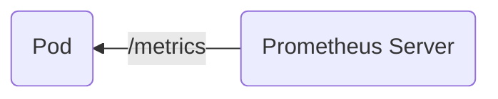
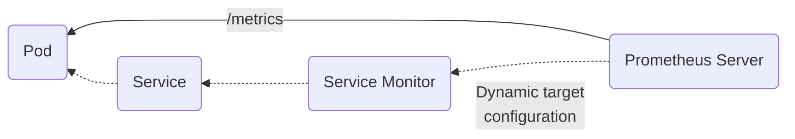
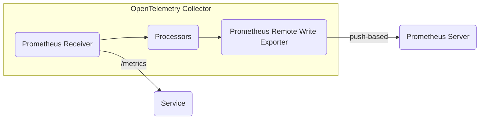
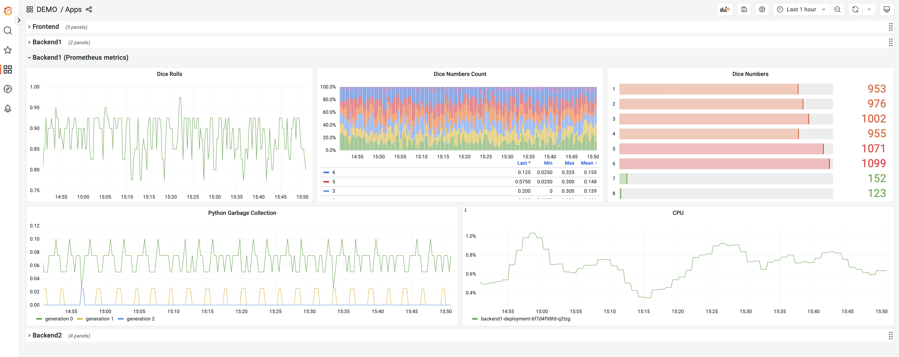
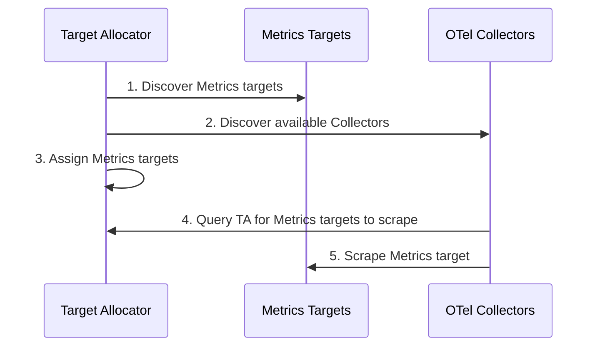
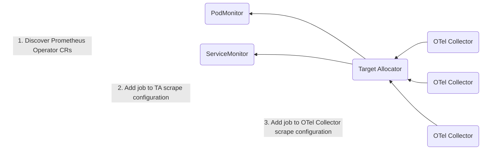
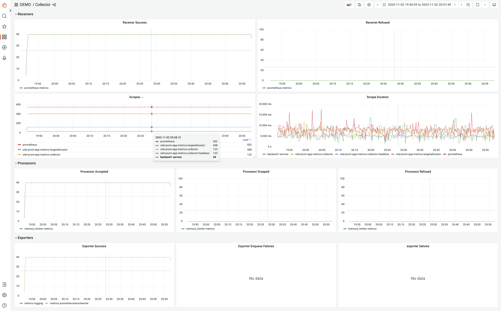
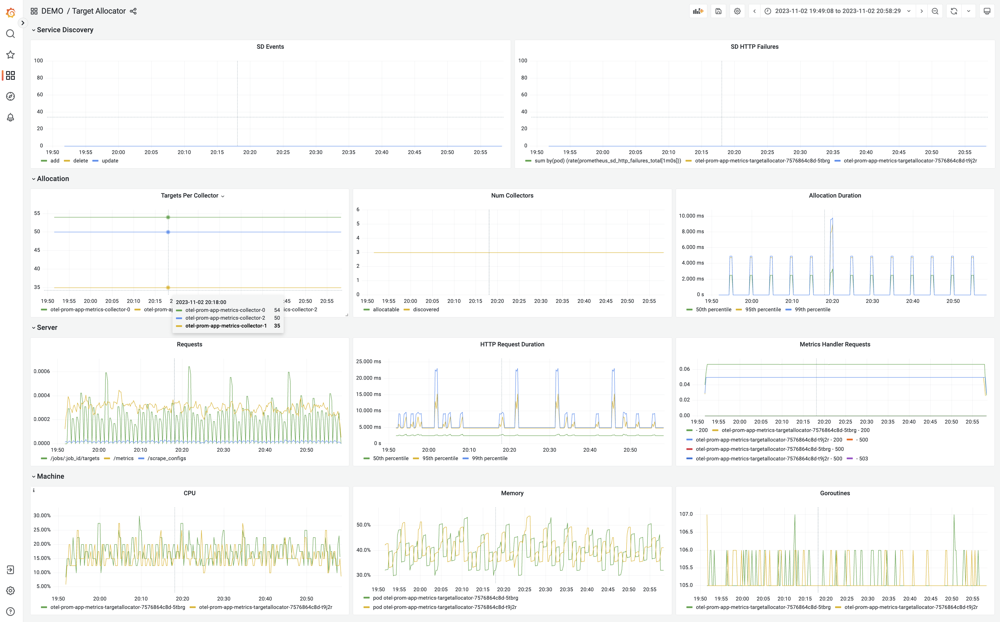

# Collecting Prometheus Metrics

This section of the tutorial will focus on:

1. Migrating from Prometheus to OpenTelemetry
2. Scaling metrics collection with the Target Allocator
3. Interoperability between Prometheus and OTLP standards
4. Considerations and current limitations

## Prerequisites

**Tutorial Application**:
- In the previous section, auto instrumentation collected OTLP metrics from `frontend`, `backend1`, and `backend2` services.
- Manual instrumentation of the `backend2` service generated Prometheus metrics in the previous setup.

**Prometheus Setup**:
- Prometheus has been installed in the environment.
- Remote write functionality is enabled to export metrics.

## 1. Migrating from Prometheus to OpenTelemetry

Prometheus has gained a strong foothold in the community, while OpenTelemetry is continuing to grow as the open standard telemetry protocol. The plan for the future is to shift towards OpenTelemetry, but this transition involves embracing new ways of instrumentation. It's a journey that involves updating frameworks and rewriting code, which makes the compatibility between OpenTelemetry and Prometheus incredibly important.

OpenTelemetry understands the challenges that come with this transition. To address them, they've introduced the Prometheus Receiver and Prometheus Remote Write (PRW) Exporter. These components make the move to OpenTelemetry a gradual, step-by-step process, ensuring a smooth transition.

### Step 1: Configure Prometheus Target Discovery

Scrape jobs can be statically configured via the `scrape_configs` parameter or dynamically discovered using Prometheus operator Custom Resources (CRs). Prometheus Operator uses `ServiceMonitor` and `PodMonitor` CRs to perform auto-discovery and auto-configuration of scraping targets.

**1. Prometheus Native Target Discovery**




**Scrape Configuration**

To setup the OpenTelemetry Collector for native Prometheus target discovery, start by excluding sections like Alerting, Storage, Recording Rules, Tracing, and Remote Read/Write, though you may want to keep that last section handy if you want to configure the Remote Write feature for the PRW exporter.

**Escaping $ Characters**

Since the Collector configuration system supports environment variable substitution any `$` characters in your prometheus configuration are interpreted as signifying the start of an environment variable. If you want to use literal `$` characters in your prometheus configuration, you must escape them using `$$`.

**Sample Prometheus Configuration Before Exclusions and Escaping**

```yaml
# Alertmanager configuration
alerting:
  alertmanagers:
    - static_configs:
        - targets:
          - alertmanager:9093

# Recording Rules
rule_files:
  - "first_rules.yml"
  - "second_rules.yml"

# Scrape Jobs 
scrape_configs:
  # App monitoring
  - job_name: 'backend2-scrape-job'
    scrape_interval: 1m
    static_configs:
      - targets: ["localhost:5000"]
    metric_relabel_configs:
    - action: labelmap
      regex: label_(.+)
      replacement: $1 
    
# Configuration for Remote Write Exporter
remote_write:
  - url: http://prometheus.observability-backend.svc.cluster.local:80/api/v1/write
```

**Sample Prometheus Configuration After Exclusions and Escaping** 

```yaml
scrape_configs:
  # App monitoring
  - job_name: 'backend2-scrape-job'
    scrape_interval: 1m
    static_configs:
      - targets: ["localhost:5000"]
    metric_relabel_configs:
    - action: labelmap
      regex: label_(.+)
      replacement: $$1
```

**2. Auto Discovery with Prometheus Operator CR's using Service and Pod Monitors**

The Prometheus operator simplifies Prometheus scrape configurations by allowing us to define [Prometheus CRs](https://github.com/prometheus-operator/prometheus-operator#customresourcedefinitions). These CRs dynamically edit the Prometheus configuration to add scrape configurations, making the process of adding and updating jobs much easier.



In order to apply a pod or service monitor, the Custom Resource Definitions (CRDs) need to be installed:

```shell
  kubectl apply -f https://raw.githubusercontent.com/prometheus-operator/prometheus-operator/main/example/prometheus-operator-crd/monitoring.coreos.com_servicemonitors.yaml

  kubectl apply -f https://raw.githubusercontent.com/prometheus-operator/prometheus-operator/main/example/prometheus-operator-crd/monitoring.coreos.com_podmonitors.yaml
```

You can verify both CRDs are present with the command `kubectl get customresourcedefinitions`. After that, ensure that the following lines are added to your list of CRDs.

```shell
  podmonitors.monitoring.coreos.com         
  servicemonitors.monitoring.coreos.com      
```

### Step 2: Setting Up OpenTelemetry Collector

The OpenTelemetry Collector can be used as a drop-in replacement for Prometheus server to scrape and export metrics data. This step will guilde you through the process of configuring the OpenTelemetry Collector to seamlessly integrate with the Prometheus discovery mechanisms mentioned above.

#### **Receivers:**

- **Prometheus Receiver:**
  - A minimal drop-in replacement for the Prometheus server to scrape metrics
  - Supports full set of Prometheus scraping, service discovery and re-labeling configurations 

#### **Exporters:**

- **Prometheus Exporter (<i>prometheus</i>):**
  - Pull-based exporter, exporting data in Prometheus format, making it suitable for scraping by a Prometheus server
  
- **Prometheus Remote Write Exporter (<i>prometheusremotewrite</i>):**
  - Push-based exporter, sending metrics to Prometheus-compatible remote write backends.


#### **Configuring Prometheus Native Service Discovery in the OpenTelemetry Collector**

To configure the OpenTelemetry Collector, you'll need to:

1. Specify target endpoints for scraping.
2. Configure the remote write exporter to send metrics to a Prometheus-compatible destination.
3. Link metrics collected from the Prometheus receiver to the remote write exporter in a Collector pipeline.



```yaml
kind: OpenTelemetryCollector
metadata:
  name: otel-prom-collector
spec:
  mode: statefulset
  replicas: 1
  config: |
    receivers:
      prometheus:
        config:
          scrape_configs:
          - job_name: 'otel-collector'
            scrape_interval: 10s
            static_configs:
            - targets: [ '0.0.0.0:8888' ]
            metric_relabel_configs:
            - action: labeldrop
              regex: (id|name)
            - action: labelmap
              regex: label_(.+)
              replacement: $$1
          - job_name: 'backend1-scrape-job'
            scrape_interval: 1m
            static_configs:
            - targets: [ 'localhost:5000' ]
      exporters:
        logging:
          loglevel: debug
        prometheus:
          endpoint: 0.0.0.0:8989
          metric_expiration: 10m
        prometheusremotewrite:
          endpoint: http://prometheus.observability-backend.svc.cluster.local:80/api/v1/write
    service:
      pipelines:
        metrics:
          exporters:
          - prometheusremotewrite
          - logging
          processors: []
          receivers:
          - prometheus
```

To experiment with the Prometheus pull-based exporter, implement the following modification:

```yaml
   service:
      pipelines:
        metrics:
          exporters:
          - prometheus
          - logging
          processors: []
          receivers:
          - prometheus
```

Applying this chart will start a new collector as a StatefulSet with prometheus scrape_configs:

```shell
kubectl apply -f https://raw.githubusercontent.com/pavolloffay/kubecon-na-2023-opentelemetry-kubernetes-metrics-tutorial/main/backend/05-collector-prom-metrics.yaml
```

You can verify the collector deployment with the command `kubectl get pods -n observability-backend`:

```shell
otel-prom-app-metrics-collector-0                       1/1     Running   0             18m
```

Now we should start seeing our backend1 prometheus metrics in the [Apps Dashboard](http://localhost:8080/grafana/d/WbvDPqY4k/apps?orgId=1):


## 2. Scaling metrics pipeline with the target allocator

The Prometheus receiver operates as a Stateful, requiring consideration of the following aspects:

- The receiver does not auto-scale the scraping process when multiple collector replicas are deployed.
- Running identical configurations across multiple collector replicas results in duplicated scrapes for targets.
- To manually shard the scraping process, users must configure each replica with distinct scraping settings.

To simplify Prometheus receiver configuration, the OpenTelemetry Operator introduces the Target Allocator, an optional component. This component serves two essential functions:

1. **Even Target Distribution:** The TA ensures fair distribution of Prometheus targets among a fleet of Collector instances.
2. **Prometheus Custom Resource Discovery:** It facilitates the discovery of Prometheus CR's for seamless integration.



### Configuring OpenTelemetry Collector with Target Allocator and Prometheus scrape configs

```yaml
kind: OpenTelemetryCollector
metadata:
  name: otel-prom-cr-with-ta
spec:
  mode: statefulset
  replicas: 3
  targetAllocator:
    enabled: true
    replicas: 2
    image: ghcr.io/open-telemetry/opentelemetry-operator/target-allocator:0.78.0
    allocationStrategy: consistent-hashing
    prometheusCR:
      enabled: false
  config: |
    receivers:
      prometheus:
        config:
          target_allocator:
            endpoint: http://otel-prom-cr-with-ta-targetallocator:80
            interval: 30s
            collector_id: ${POD_NAME}
            http_sd_config:
              refresh_interval: 60s
          scrape_configs:
          - job_name: 'otel-collector'
            scrape_interval: 10s
            static_configs:
            - targets: [ '0.0.0.0:8888' ]
            metric_relabel_configs:
            - action: labeldrop
              regex: (id|name)
            - action: labelmap
              regex: label_(.+)
              replacement: $$1
          - job_name: 'backend1-scrape-job'
            scrape_interval: 1m
            static_configs:
            - targets: ["localhost:8888"]
      exporters:
        logging:
          loglevel: debug
        prometheus:
          endpoint: 0.0.0.0:8989
          metric_expiration: 10m
        prometheusremotewrite:
          endpoint: http://prometheus.observability-backend.svc.cluster.local:80/api/v1/write
    service:
      pipelines:
        metrics:
          exporters:
          - prometheusremotewrite
          - logging
          processors: []
          receivers:
          - prometheus
```

### Configuring OpenTelemetry Collector with Target Allocator and Prometheus CR's



Notable changes in the Collector CR compared to the collector Deployment we applied earlier:

```yaml
spec:
  mode: statefulset
  replicas: 3
  targetAllocator:
    enabled: true
    allocationStrategy: "consistent-hashing"
    replicas: 2
    image: ghcr.io/open-telemetry/opentelemetry-operator/target-allocator:0.78.0
    prometheusCR:
      enabled: true

  config: |
    receivers:
      prometheus:
        target_allocator:
          endpoint: http://otel-prom-cr-with-ta-targetallocator:80
          interval: 30s
          collector_id: ${POD_NAME}
          http_sd_config:
            refresh_interval: 60s
        config:
          scrape_configs:
```

Applying this chart will start a new collector as a StatefulSet with the target allocator enabled, and it will create a ClusterRole granting the TargetAllocator the permissions it needs:

```shell
kubectl apply -f https://raw.githubusercontent.com/pavolloffay/kubecon-na-2023-opentelemetry-kubernetes-metrics-tutorial/main/backend/05-collector-prom-metrics-with-ta.yaml
```

Applying this chart will set up service monitors for the backend1 service, the target allocators, and the collector statefulset:

```shell
kubectl apply -f https://raw.githubusercontent.com/pavolloffay/kubecon-na-2023-opentelemetry-kubernetes-metrics-tutorial/main/backend/05-servicemonitor.yaml
```

You can verify the collectors and target allocators have been deployed with the command `kubectl get pods -n observability-backend`, where we should see five additional pods:
```shell
otel-prom-app-metrics-collector-0                       1/1     Running   0             18m
otel-prom-app-metrics-collector-1                       1/1     Running   0             18m
otel-prom-app-metrics-collector-2                       1/1     Running   0             18m
otel-prom-app-metrics-targetallocator-f844684ff-fwrzj   1/1     Running   0             18m
otel-prom-app-metrics-targetallocator-f844684ff-r4jd2   1/1     Running   0             18m
```

The service monitors can also be verified with `kubectl get servicemonitors -A`:
```shell
NAMESPACE               NAME                                AGE
observability-backend   otel-prom-cr-collector-monitoring   21m
observability-backend   otel-prom-cr-targetallocator        21m
tutorial-application    backend1-service                    21m
```

We should now expect to continue seeing the Prometheus metrics for our backend1 service in the [Apps Dashboard](http://localhost:8080/grafana/d/WbvDPqY4k/apps?orgId=1):


The OpenTelemetry Collctor now has its own metrics in the [Collector Dashboard](http://localhost:8080/grafana/d/7hHiATL4z/collector?orgId=1):


And the Target Allocator has its own metrics in the [Target Allocator Dashboard](http://localhost:8080/grafana/d/ulLjw3L4z/target-allocator?orgId=1):


## 3. Interoperability between Prometheus and OTLP standards

As previously discussed, the shift to OpenTelemetry can occur incrementally. Initially, we can transition the backend to one that is OTLP compatible and then gradually update the instrumentation.

For instance: [prometheus] Receiver -> [otlphttp] Exporter

Sample configuration:

```yaml
spec:
  mode: statefulset
  replicas: 3
  targetAllocator:
    enabled: true
    allocationStrategy: "consistent-hashing"
    replicas: 2
    image: ghcr.io/open-telemetry/opentelemetry-operator/target-allocator:0.74.0
    prometheusCR:
      enabled: true
  config: |
    receivers:
      prometheus:
        target_allocator:
          endpoint: http://otel-prom-cr-targetallocator:80
          interval: 30s
          collector_id: ${POD_NAME}
          http_sd_config:
            refresh_interval: 60s
        config:
          scrape_configs:
    exporters:
        otlphttp:
          endpoint: http://prometheus.observability-backend.svc.cluster.local:80/api/v1/otlp/
      pipelines:
        metrics:
          exporters:
          - otlphttp
          processors: []
          receivers:
          - prometheus
```

Likewise, it is possible to accept metrics via OTLP and produce them to a PRW-compatible backend.  This can be useful if you wish to continue utilizing a Prometheus-compatible backend while taking advantage of OpenTelemetry auto-instrumentation or libraries natively instrumented with OpenTelemetry metrics.

## 4. Considerations and current limitations

**Non-compatible formats:**

Using OTLP as an intermediary format between two non-compatible formats.  Prometheus operates on metrics with cumulative aggregation temporality and cannot interoperate with systems that use delta aggregation temporality.

1. Importing statsd => Prometheus PRW
2. Importing collectd => Prometheus PRW
3. Importing Prometheus endpoint scrape => [statsd push | collectd | opencensus]

**Name normalization:**

While Prometheus uses a certain metrics naming convention, OpenTelemetry implements different semantic conventions for metrics, and the two open standards do not fully conform.  For instance, Prometheus conventionally appends unit identifiers to metric names whereas OpenTelemetry stores this information separately from the name.  The OpenTelemetry Collector's Prometheus receiver and exporters will attempt to perform a mapping from name to metadata and back to make this transparent when it can.

**Unsupported Prometheus features**

Much like Prometheus in agent-mode, there are a few advanced Prometheus features that the receiver does not support. The receiver returns an error if the configuration contains any of the following:

```
alert_config.alertmanagers
alert_config.relabel_configs
remote_read
remote_write
rule_files
```

---
[Next steps](./06-collecting-k8s-infra-metrics.md)
