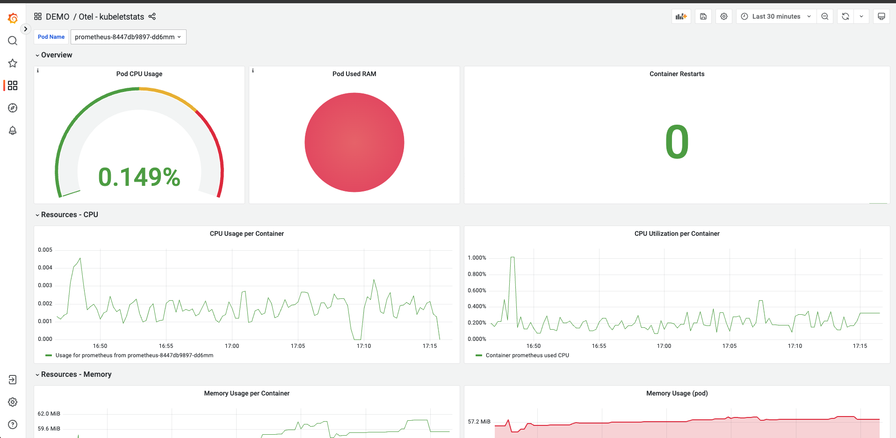
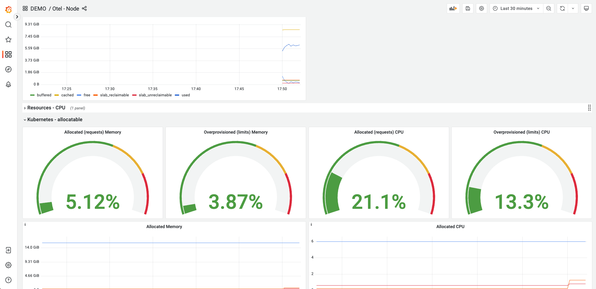
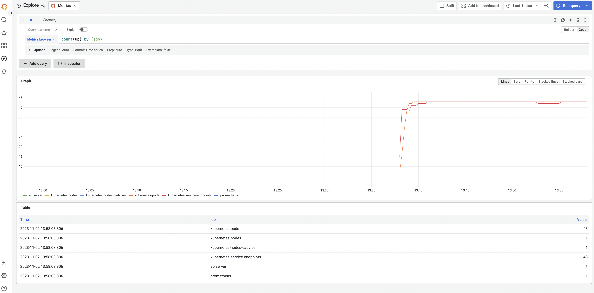

# Collecting Kubernetes infrastracture metrics

This section of tutorial will focus specifically how to collect your infrastructure metrics with OpenTelemetry Operator. The collection of infrastructure metrics consists of a few components that will be introduced. Parts of this document are based on ["Important Components for Kubernetes"](https://opentelemetry.io/docs/kubernetes/collector/components/) by OpenTelemetry authors which is licensed under [CC BY 4.0](https://creativecommons.org/licenses/by/4.0/). Some parts have been adjusted for the purpose of this tutorial.

## Prerequisite - Service Account

Many Kubernetes related components in this part of tutorial use the Kubernetes API, therefore they require proper permissions to work correctly. For most cases, you should give the service account running the collector the following permissions via a ClusterRole. As we go through this secion of the tutorial, we will create appropriate service account and cluster roles. You can inspect them yourself in this [file](backend/06-collector-k8s-cluster-metrics.yaml).

## Setting Up OpenTelemetry Collector for Kubernetes Metrics

Applying the below YAML will install the OpenTelemetry Collector configured to receive and scrape all necessary metrics, important for monitoring your Kubernetes cluster. Go ahead and run the following:

```bash
kubectl apply -f https://raw.githubusercontent.com/pavolloffay/kubecon-na-2023-opentelemetry-kubernetes-metrics-tutorial/main/backend/06-collector-k8s-cluster-metrics.yaml
```

This will create a new instance of the OpenTelemetry collector and related objects, configured for Kubernetes metrics collection. Check your setup by running:

```bash
kubectl get -n observability-backend pod
```

Your output should look similar to this:

```bash
NAME                                                        READY   STATUS    RESTARTS   AGE
otel-k8s-cluster-metrics-collector-0                        1/1     Running   0          7s
otel-k8s-cluster-metrics-collector-1                        1/1     Running   0          7s
otel-k8s-cluster-metrics-collector-2                        1/1     Running   0          7s
otel-k8s-cluster-metrics-targetallocator-6d8dbd4c9c-gdt6p   1/1     Running   0          7s
otel-k8s-cluster-metrics-targetallocator-6d8dbd4c9c-lhdmv   1/1     Running   0          7s
```

You're ready to receive metrics from your Kubernetes cluster! Let's go through the each component of the collector configuration and see what they do.

## Kubelet Stats Receiver

Each Kubernetes node runs a kubelet that includes an API server. The Kubernetes Receiver connects to that kubelet via the API server to collect metrics about the node and the workloads running on the node. Due to the nature of this component, we recommend to run it as a daemon set on each node.

There are different methods for authentication, but typically a service account is used (as is also the case for this tutorial). By default, metrics will be collected for pods and nodes, but you can configure the receiver to collect container and volume metrics as well. The receiver also allows configuring how often the metrics are collected. Inspect the following section of the configuration.

https://github.com/pavolloffay/kubecon-na-2023-opentelemetry-kubernetes-metrics-tutorial/blob/bc594eac8a9eb63d285afb9655cc427c973edb47/backend/06-collector-k8s-cluster-metrics.yaml#L40-L44

For specific details about which metrics are collected, see
[Default Metrics](https://github.com/open-telemetry/opentelemetry-collector-contrib/blob/main/receiver/kubeletstatsreceiver/documentation.md).
For specific configuration details, see
[Kubeletstats Receiver](https://github.com/open-telemetry/opentelemetry-collector-contrib/blob/main/receiver/kubeletstatsreceiver).

Open the [Kubelet Dashboard](http://localhost:3000/grafana/d/qJfRfcsVk/otel-kubeletstats?orgId=1) and you'll see information about the pod of your choice:


## Kubernetes Cluster Receiver

The Kubernetes Cluster Receiver collects metrics and entity events about the
cluster as a whole using the Kubernetes API server. Use this receiver to answer
questions about pod phases, node conditions, and other cluster-wide questions.
Since the receiver gathers telemetry for the cluster as a whole, only one
instance of the receiver is needed across the cluster in order to collect all
the data.

There are different methods for authentication, but typically a service account
is used (as is also the case for this tutorial). For node conditions, the receiver only collects `Ready` by default, but it can
be configured to collect more. The receiver can also be configured to report a
set of allocatable resources, such as `cpu` and `memory`. The `k8s_cluster` receiver looks as follows:

https://github.com/pavolloffay/kubecon-na-2023-opentelemetry-kubernetes-metrics-tutorial/blob/bc594eac8a9eb63d285afb9655cc427c973edb47/backend/06-collector-k8s-cluster-metrics.yaml#L45-L52

To learn more about the metrics that are collected, see
[Default Metrics](https://github.com/open-telemetry/opentelemetry-collector-contrib/blob/main/receiver/k8sclusterreceiver/documentation.md)
For configuration details, see
[Kubernetes Cluster Receiver](https://github.com/open-telemetry/opentelemetry-collector-contrib/tree/main/receiver/k8sclusterreceiver).

## Host Metrics Receiver

The Host Metrics Receiver collects metrics from a host using a variety of scrapers. There are a number of scrapers that collect metrics for particular parts of the system. Overview of the available scrapers:

| Scraper    | Supported OSs       | Description                                            |
| ---------- | ------------------- | ------------------------------------------------------ |
| cpu        | All except Mac      | CPU utilization metrics                                |
| disk       | All except Mac      | Disk I/O metrics                                       |
| load       | All                 | CPU load metrics                                       |
| filesystem | All                 | File System utilization metrics                        |
| memory     | All                 | Memory utilization metrics                             |
| network    | All                 | Network interface I/O metrics & TCP connection metrics |
| paging     | All                 | Paging/Swap space utilization and I/O metrics          |
| processes  | Linux, Mac          | Process count metrics                                  |
| process    | Linux, Windows, Mac | Per process CPU, Memory, and Disk I/O metrics          |

There is some overlap with the [Kubeletstats Receiver](#kubeletstats-receiver) so if you decide to use both, it may be worth it to disable these duplicate metrics. 

In order to correctly scrape node metrics, make sure to mount the `hostfs` volume if you want to collect the actual node's metrics. You can inspect the [configuration]((backend/06-collector-k8s-cluster-metrics.yaml)) to see how the `hostfs` volume is mounted. Configuration for `hostmetrics`, in simplest form, looks as follows:

```yaml
receivers:
  hostmetrics:
    root_path: /hostfs
    collection_interval: 10s
    scrapers:
      cpu:
      load:
      memory:
      disk:
      filesystem:
      network:
```

However, the full-fledged configuration for our tutorials requires some extra scraper configurtaions and metrics enabled. To inspect the full `hostmetrics` configuration, see the relevant part of the [collector configuration](https://github.com/pavolloffay/kubecon-na-2023-opentelemetry-kubernetes-metrics-tutorial/blob/bc594eac8a9eb63d285afb9655cc427c973edb47/backend/06-collector-k8s-cluster-metrics.yaml#L53).

Let's take a look at our dashboard now. Open the [node dashboard](http://localhost:3000/grafana/d/OiEkUDsVk/otel-node?orgId=1) and you'll see information about the node of your choice:



## Prometheus Receiver

Prometheus serves as a standard metrics format for both Kubernetes and services within Kubernetes clusters. In a typical Kubernetes cluster, we have several core components that require monitoring, such as `kube-controller-manager`, `kube-proxy`, `kube-apiserver`, `kube-scheduler` and `kubelet`. Most of the metrics for the key components come embedded with the Kubelet. For specific metrics related to these components, deployments of exporters like `kube-state-metrics`, `node-exporter`, and `Blackbox Exporter` are required. 

For our tutorial, we set up the OpenTelemetry collector to scrape these embedded metrics. The Prometheus upstream repository provides a helpful reference for configuring scraping, which you can find [here](https://raw.githubusercontent.com/prometheus/prometheus/main/documentation/examples/prometheus-kubernetes.yml). It contains the necessary configurations for discovering pods and services in your Kubernetes cluster. Our Prometheus receiver scrape configuration includes the following defined scrape jobs: 

1. **kubernetes-apiservers:** This job pulls in metrics from the API servers.
2. **kubernetes-nodes:** It collects metrics specific to Kubernetes nodes.
3. **kubernetes-pods:** All pods with annotations for scraping and port specifications are scraped.
4. **kubernetes-service-endpoints:** All service endpoints with annotations for scraping and port specifications are scraped.
5. **kubernetes-cadvisor:** This job captures metrics from cAdvisor, providing container metrics.

OpenTelmetry collector configuration - https://github.com/pavolloffay/kubecon-na-2023-opentelemetry-kubernetes-metrics-tutorial/blob/d1e79b75928027769c15b35e7e12d2447e159274/backend/06-collector-k8s-cluster-metrics.yaml#L108

To view the list of all scrape jobs and the count of active targets for each job, you can access [Grafana Explore](http://localhost:3000/grafana/explore?orgId=1&left=%7B%22datasource%22:%22PA58DA793C7250F1B%22,%22queries%22:%5B%7B%22refId%22:%22A%22,%22datasource%22:%7B%22type%22:%22prometheus%22,%22uid%22:%22PA58DA793C7250F1B%22%7D,%22editorMode%22:%22code%22,%22expr%22:%22count%28up%29%20by%20%28job%29%22,%22legendFormat%22:%22__auto%22,%22range%22:true,%22instant%22:true%7D%5D,%22range%22:%7B%22from%22:%22now-1h%22,%22to%22:%22now%22%7D%7D) 



To view Prometheus metrics for the Kubernetes API server, you can access the [k8s API Server Dashboard](http://localhost:3000/grafana/d/k8s_system_apisrv/kubernetes-system-api-server?orgId=1)


---
[Next steps](./07-correlation.md)
